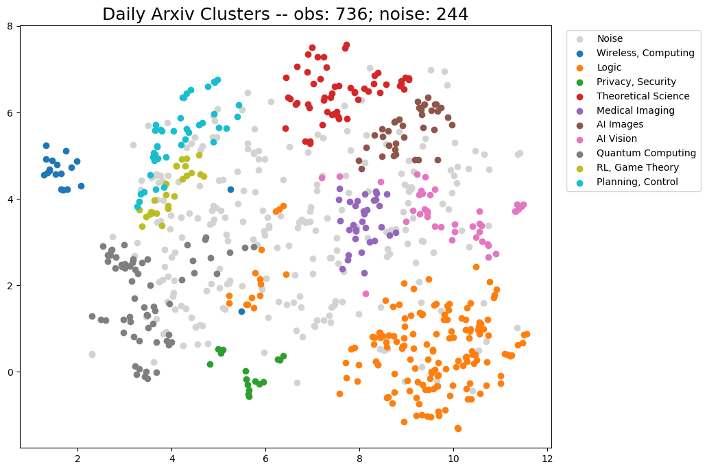

# The Hacker theme



## Usage

### Stylesheet

If you'd like to add your own custom styles:

1. Create a file called `/assets/css/style.scss` in your site
2. Add the following content to the top of the file, exactly as shown:
    ```scss
    ---
    ---

    @import "{{ site.theme }}";
    ```
3. Add any custom CSS (or Sass, including imports) you'd like immediately after the `@import` line

*Note: If you'd like to change the theme's Sass variables, you must set new values before the `@import` line in your stylesheet.*

### Layouts

If you'd like to change the theme's HTML layout:

1. For some changes such as a custom `favicon`, you can add custom files in your local `_includes` folder. The files [provided with the theme](https://github.com/pages-themes/hacker/tree/master/_includes) provide a starting point and are included by the [original layout template](https://github.com/pages-themes/hacker/blob/master/_layouts/default.html).
2. For more extensive changes, [copy the original template](https://github.com/pages-themes/hacker/blob/master/_layouts/default.html) from the theme's repository<br />(*Pro-tip: click "raw" to make copying easier*)
3. Create a file called `/_layouts/default.html` in your site
4. Paste the default layout content copied in the first step
5. Customize the layout as you'd like

### Customizing Google Analytics code

Google has released several iterations to their Google Analytics code over the years since this theme was first created. If you would like to take advantage of the latest code, paste it into `_includes/head-custom-google-analytics.html` in your Jekyll site.

### Overriding GitHub-generated URLs

Templates often rely on URLs supplied by GitHub such as links to your repository or links to download your project. If you'd like to override one or more default URLs:

1. Look at [the template source](https://github.com/pages-themes/hacker/blob/master/_layouts/default.html) to determine the name of the variable. It will be in the form of `{{ site.github.zip_url }}`.
2. Specify the URL that you'd like the template to use in your site's `_config.yml`. For example, if the variable was `site.github.url`, you'd add the following:
    ```yml
    github:
      zip_url: http://example.com/download.zip
      another_url: another value
    ```
3. When your site is built, Jekyll will use the URL you specified, rather than the default one provided by GitHub.

*Note: You must remove the `site.` prefix, and each variable name (after the `github.`) should be indent with two space below `github:`.*

For more information, see [the Jekyll variables documentation](https://jekyllrb.com/docs/variables/).
